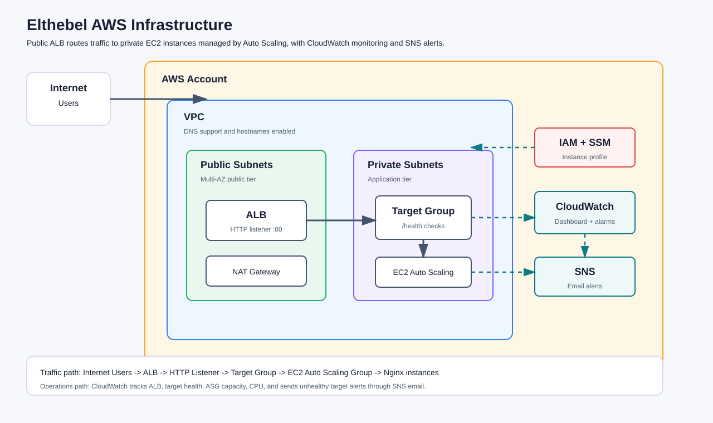
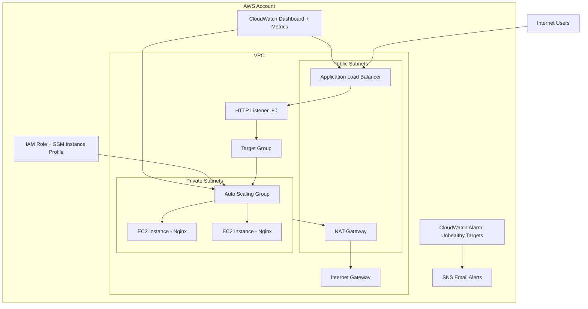
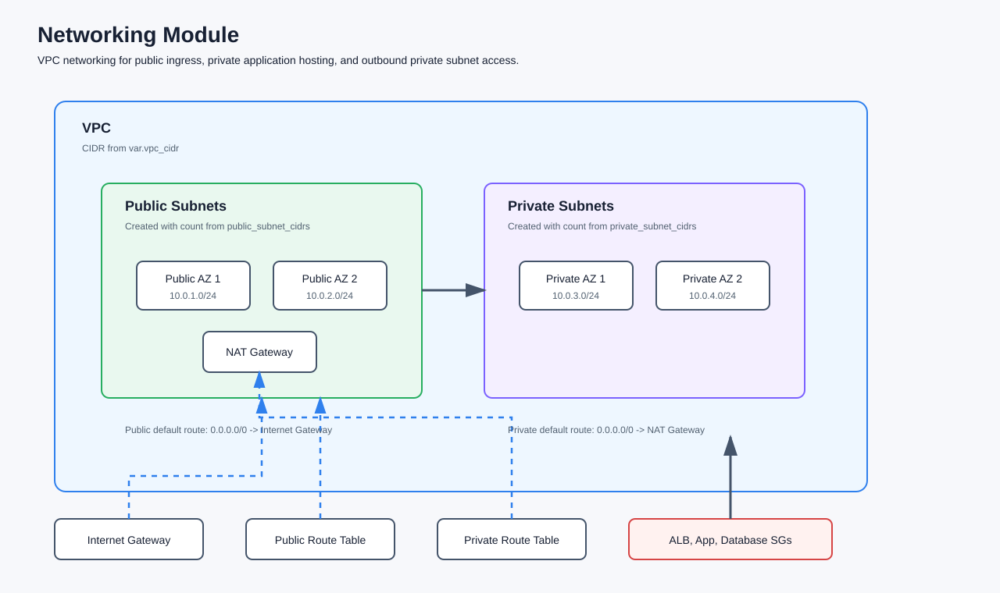
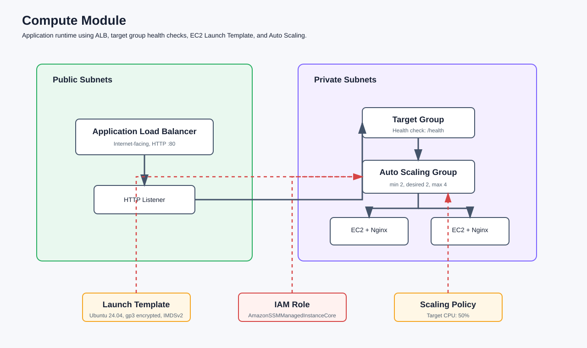
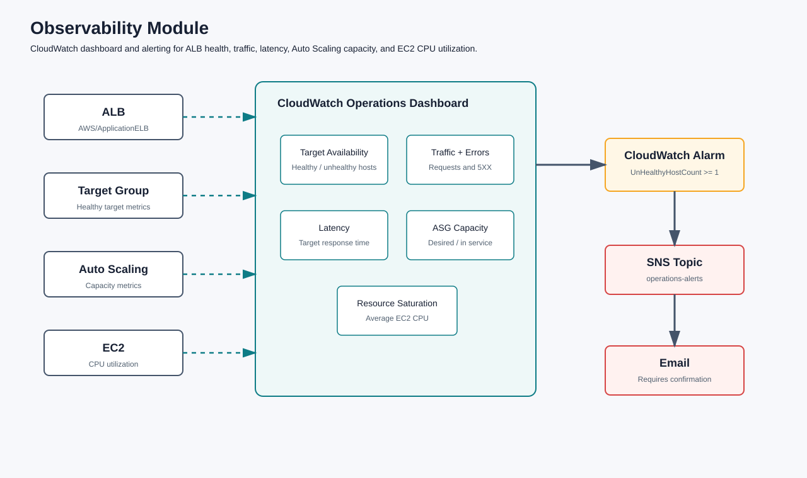

# Elthebel Infrastructure

Terraform infrastructure for the Elthebel development environment on AWS. This project provisions a modular, multi-AZ web application foundation with public ingress through an Application Load Balancer, private EC2 instances managed by an Auto Scaling Group, and operational monitoring through CloudWatch and SNS.

## Architecture





## Features

- Modular Terraform structure for networking, compute, and observability.
- Multi-AZ VPC with public and private subnet tiers.
- Internet Gateway for public traffic and NAT Gateway for private subnet outbound access.
- Application Load Balancer exposed on HTTP port 80.
- Target Group health checks against `/health`.
- EC2 Auto Scaling Group across private subnets with desired capacity of 2 and max capacity of 4.
- Launch Template using the latest Ubuntu 24.04 LTS AMI from Canonical.
- Nginx bootstrap through EC2 user data.
- IAM role and instance profile with AWS Systems Manager access.
- Encrypted gp3 root volumes.
- Instance metadata service v2 enforced.
- Target tracking Auto Scaling policy based on average CPU utilization.
- CloudWatch operations dashboard for availability, traffic, errors, latency, ASG capacity, and CPU.
- CloudWatch alarm for unhealthy ALB targets.
- SNS email notification subscription for infrastructure alerts.
- Consistent AWS default tags for project, environment, and Terraform ownership.

## Project Structure

```text
.
|-- docs/
|   |-- architecture/
|   `-- screenshots/
|-- envs/
|   `-- dev/
|       |-- main.tf
|       |-- output.tf
|       |-- provider.tf
|       |-- terraform.tfvars.example
|       `-- variables.tf
|-- modules/
|   |-- compute/
|   |   |-- main.tf
|   |   |-- output.tf
|   |   `-- variables.tf
|   |-- networking/
|   |   |-- main.tf
|   |   |-- outputs.tf
|   |   `-- variables.tf
|   `-- observability/
|       |-- main.tf
|       |-- output.tf
|       `-- variable.tf
|-- .gitignore
|-- README.md
`-- note
```

## Modules

### Networking



Creates the core network layer:

- VPC with DNS support and hostnames enabled.
- Public subnets with public IP assignment.
- Private subnets for application instances.
- Internet Gateway.
- NAT Gateway with Elastic IP.
- Public and private route tables.
- Security groups for the ALB, application tier, and database tier.

### Compute



Creates the application runtime layer:

- Ubuntu EC2 Launch Template.
- EC2 IAM role and instance profile.
- Nginx bootstrap user data.
- Public Application Load Balancer.
- HTTP listener.
- Target Group with health checks.
- Auto Scaling Group in private subnets.
- Rolling instance refresh.
- CPU target tracking scaling policy.

### Observability



Creates the monitoring and alerting layer:

- CloudWatch operations dashboard.
- ALB healthy and unhealthy target metrics.
- ALB request and HTTP 5XX metrics.
- Target response time metric.
- Auto Scaling capacity metrics.
- EC2 CPU utilization metric.
- CloudWatch alarm for unhealthy targets.
- SNS topic and email subscription for alerts.

## Prerequisites

- Terraform `>= 1.5.0`
- AWS provider `~> 5.0`
- AWS CLI configured with credentials for the target account
- Permission to create VPC, EC2, IAM, Auto Scaling, ALB, CloudWatch, and SNS resources

## Deployment

From the dev environment directory:

```powershell
cd envs/dev
copy terraform.tfvars.example terraform.tfvars
```

Edit `terraform.tfvars` and set the required values:

```hcl
aws_region   = "us-east-1"
project_name = "elthebel"
environment  = "dev"
alert_email  = "you@example.com"
```

Then initialize, validate, plan, and apply:

```powershell
terraform init
terraform fmt -recursive
terraform validate
terraform plan -out=tfplan
terraform apply tfplan
```

After apply completes, confirm the SNS email subscription from the inbox configured in `alert_email`.

## Outputs

The dev environment exposes:

- `alb_dns_name` - public DNS name of the Application Load Balancer.
- `autoscaling_group_name` - name of the application Auto Scaling Group.
- `cloudwatch_dashboard_name` - name of the CloudWatch operations dashboard.

To view outputs:

```powershell
terraform output
```

To test the deployed application:

```powershell
terraform output alb_dns_name
```

Open the ALB DNS name in a browser. The deployed Nginx page should display the Elthebel API Server health page.

## Screenshots

Architecture images included in this repository:

| Diagram | File |
| --- | --- |
| Full AWS architecture | `docs/architecture/high-level-architecture.svg` |
| Networking module | `docs/architecture/networking-architecture.svg` |
| Compute module | `docs/architecture/compute-architecture.svg` |
| Observability module | `docs/architecture/observability-architecture.svg` |

Add screenshots after a successful deployment:

| Area | Suggested screenshot |
| --- | --- |
| Application | Browser showing the ALB DNS name and Elthebel API Server response |
| Load Balancer | AWS console view of the ALB and healthy target group |
| Auto Scaling | AWS console view of the Auto Scaling Group instances |
| Monitoring | CloudWatch operations dashboard |
| Alerts | SNS topic and confirmed email subscription |

Recommended local folder:

```text
docs/screenshots/
```

Suggested image links once screenshots are added:

```markdown


```

## Destroy

To remove the dev environment:

```powershell
cd envs/dev
terraform destroy
```

Review the destroy plan carefully before confirming.

## Notes

- The current application bootstrap installs Nginx and serves a simple static health response.
- Instances are deployed in private subnets and receive inbound HTTP traffic only through the ALB security group.
- The ALB security group allows inbound HTTP and HTTPS, but only the HTTP listener is currently defined.
- Terraform state files and variable files are intentionally ignored by Git.
